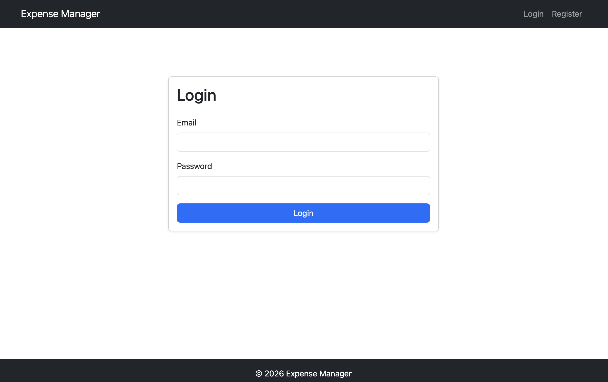
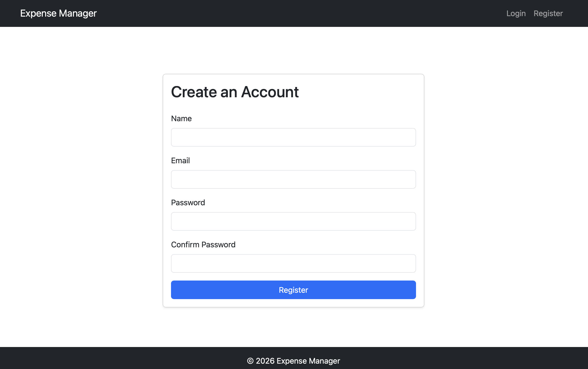
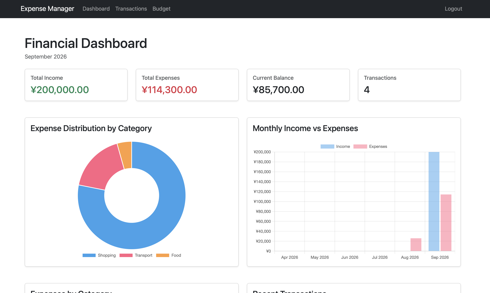
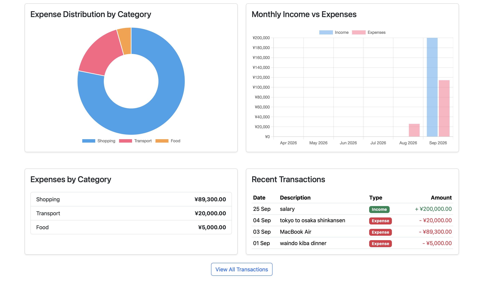
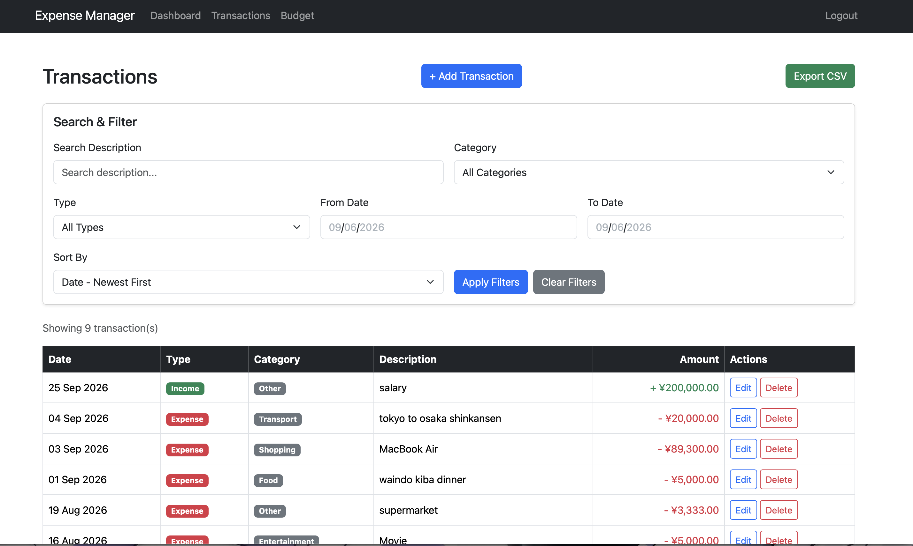
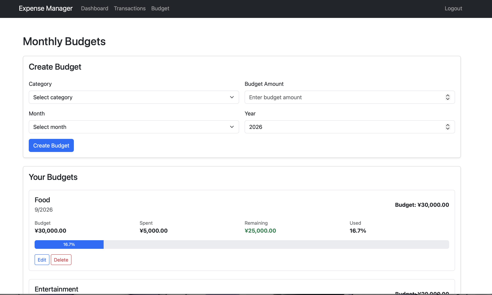

# Personal Expense & Budget Manager

個人の収入・支出・月別予算を管理するためのFlask Webアプリケーションです。

ユーザーごとに取引と予算を管理し、Dashboardのグラフで収支状況を確認できます。

## 主な機能

- ユーザー登録、ログイン、ログアウト
- パスワードのハッシュ化
- 収入・支出の登録、編集、削除
- カテゴリによる取引管理
- 説明、カテゴリ、種類、日付による検索・絞り込み
- 日付または金額による並び替え
- 取引履歴のCSVエクスポート
- カテゴリごとの月別予算の登録、編集、削除
- 予算額、使用額、残額、使用率の表示
- 月間収入、支出、残高、取引件数の集計
- Chart.jsによるカテゴリ別支出と月別収支の表示
- CSRF対策を行ったPOSTフォーム
- Flask-Migrateによるデータベース変更履歴の管理

## アプリケーション画面

### Login



### User Registration



### Financial Dashboard



### Dashboard Details



### Transactions



### Monthly Budgets



## 使用技術

### Backend

- Python
- Flask
- Flask-SQLAlchemy
- SQLAlchemy
- Flask-Login
- Flask-WTF
- Flask-Migrate / Alembic
- Gunicorn

### Database

- SQLite（デフォルト）
- `DATABASE_URL`による接続先の設定

### Frontend

- HTML / Jinja
- CSS
- Bootstrap
- JavaScript
- Chart.js

### Testing

- Python `unittest`
- Flask test client

## アーキテクチャ

アプリケーションはFlask Blueprintを使用し、機能と責務ごとに分割しています。

- **Model**: データベースのテーブルとリレーションを定義
- **Route / Controller**: HTTPリクエストを受け取り、レスポンスを返す
- **Form / Validator**: 入力値の検証と型変換を行う
- **Service**: データ登録、更新、削除、集計などの業務ロジックを実行

```text
Expense-App/
├── app.py
├── expense_app/
│   ├── __init__.py
│   ├── config.py
│   ├── extensions.py
│   ├── commands.py
│   ├── models/
│   │   ├── user.py
│   │   ├── category.py
│   │   ├── transaction.py
│   │   └── budget.py
│   ├── auth/
│   │   ├── routes.py
│   │   ├── forms.py
│   │   └── service.py
│   ├── transactions/
│   │   ├── routes.py
│   │   ├── forms.py
│   │   └── service.py
│   ├── budgets/
│   │   ├── routes.py
│   │   ├── forms.py
│   │   └── service.py
│   └── dashboard/
│       ├── routes.py
│       └── service.py
├── migrations/
├── templates/
├── static/
├── screenshots/
├── tests/
├── instance/
│   └── expense_manager.db
├── .env.example
├── requirements.txt
└── README.md
```

## ローカル環境のセットアップ

### 1. リポジトリを取得

```bash
git clone https://github.com/rohank74/Expense_App.git Expense-App
cd Expense-App
```

### 2. 仮想環境を作成して有効化

macOS / Linux:

```bash
python3 -m venv .venv
source .venv/bin/activate
```

Windows PowerShell:

```powershell
python -m venv .venv
.venv\Scripts\Activate.ps1
```

### 3. ライブラリをインストール

```bash
python -m pip install -r requirements.txt
```

### 4. 環境変数ファイルを作成

```bash
cp .env.example .env
```

新しい`SECRET_KEY`を生成します。

```bash
python -c "import secrets; print(secrets.token_hex(32))"
```

生成された値を`.env`に設定します。

```dotenv
SECRET_KEY=生成した秘密鍵
FLASK_DEBUG=true
DATABASE_URL=sqlite:///expense_manager.db
```

`.env`はGitの管理対象外です。秘密鍵をGitHubへ追加しないでください。

### 5. データベースを最新状態にする

```bash
flask --app app db upgrade
flask --app app seed-categories
```

`db upgrade`は未適用のマイグレーションを適用します。`seed-categories`は不足している初期カテゴリだけを追加するため、複数回実行しても重複しません。

### 6. 開発サーバーを起動

```bash
python app.py
```

ブラウザで `http://127.0.0.1:5000` を開きます。停止する場合はターミナルで `Control + C` を押します。

## 本番用サーバーでの起動

本番環境では、`.env`ファイルではなくホスティングサービスの環境変数設定に、新しい`SECRET_KEY`、`FLASK_DEBUG=false`、`DATABASE_URL`を登録してください。

デプロイ時にマイグレーションを適用します。

```bash
flask --app app db upgrade
flask --app app seed-categories
```

Gunicornでアプリケーションを起動します。

```bash
gunicorn --workers 2 --bind 0.0.0.0:$PORT app:app
```

`python app.py`はローカル開発用です。GunicornはFlaskの開発サーバーとは別の本番向けWSGIサーバーです。

## データベースの変更方法

モデルを変更した後、次のコマンドでマイグレーションを作成します。

```bash
flask --app app db migrate -m "Describe the database change"
```

生成された`migrations/versions/`内のファイルを確認してから適用します。

```bash
flask --app app db upgrade
```

現在の状態と未生成の変更を確認できます。

```bash
flask --app app db current
flask --app app db check
```

直前のマイグレーションを戻す場合は、事前にデータベースをバックアップしてから実行します。

```bash
flask --app app db downgrade -1
```

## テスト

すべてのテストを実行します。

```bash
python -m unittest discover -s tests -v
```

テストでは、認証が必要なページ、HTTPメソッド、CSRF保護、取引・予算の登録処理、入力値の型変換などを確認します。

## セキュリティ

- パスワードはWerkzeugでハッシュ化して保存します。
- ログイン状態はFlask-Loginで管理します。
- ユーザーは自分の取引と予算のみ表示・変更できます。
- POSTフォームはFlask-WTFのCSRFトークンで保護します。
- ログアウト、削除、登録、更新などの状態変更にはPOSTを使用します。
- `SECRET_KEY`はソースコードに記載せず、環境変数から取得します。
- Debugモードは`FLASK_DEBUG`で制御し、本番環境では無効にします。
- データベース構造の変更はFlask-Migrateで履歴管理します。

## 今後追加できる機能

- ページネーション
- 予算超過通知
- CSVインポート
- REST API
- テストケースの追加
- Docker対応
- PostgreSQLなど本番向けデータベースへの対応

## ライセンス

ライセンスは現在指定されていません。
